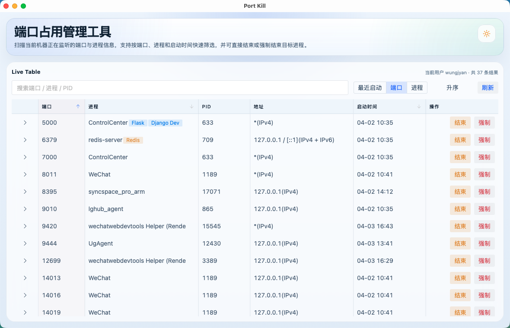
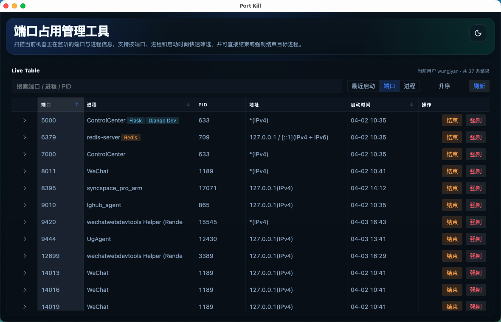

# Port Kill

一个基于 `Tauri 2 + Vue 3 + TypeScript + Rust` 的桌面端口占用管理工具，用来查看本机正在监听的端口、定位对应进程，并直接发送结束或强制结束信号。

## 当前状态

当前版本只适用于 **macOS**。

原因很直接：后端实现依赖 macOS 上的系统命令和固定路径：

- `/usr/sbin/lsof`
- `/bin/ps`
- `/bin/kill`

因此它现在不是通用跨平台版本：

- macOS：当前目标平台，可正常使用
- Linux：未做兼容性验证
- Windows：当前不支持

项目主要面向本地开发场景，用来快速定位是谁占用了常见端口，例如 `3000`、`5173`、`5432`、`6379`、`8080`。

## 预览

<p align="center">
  
  
</p>

## 功能特性

- 扫描当前机器的 TCP 监听端口
- 按 PID 聚合端口进程信息
- 展示端口、进程名、PID、监听地址、启动时间
- 支持关键字搜索
- 支持按最近启动、端口、进程名排序
- 支持普通结束和强制结束进程
- 自动刷新端口列表，默认每 5 秒刷新一次
- 内置常见开发端口提示标签，例如 Vite、Next.js、PostgreSQL、Redis、MongoDB
- 支持浅色 / 深色主题切换

## 开发

安装依赖：

```bash
pnpm install
```

启动桌面开发模式：

```bash
pnpm tauri dev
```

构建：

```bash
pnpm build
pnpm tauri build
```

## 权限与限制

- 只能结束当前用户有权限操作的进程
- 对系统进程或其他用户进程，可能会收到权限不足错误
- 当前只扫描 `TCP LISTEN`，不包含 UDP，也不展示已建立连接
- 当前版本仅面向 macOS
